# Crowdfunding Back End - Backyard Festival

Created by Becky Cole

Deployed API: https://backyard-festival-62ea19175310.herokuapp.com/fundraisers/

## Planning:

### Backyard Festival – Crowdfunding Platform for Events on a Shoestring!

Backyard Festival is a full-stack crowdfunding platform designed to help event organisers run grassroots/small-to-medium community events such as local music concerts, bachelorette parties, Church functions, school fundraisers, street marches, charity bike rides etc.

Unlike traditional crowdfunding sites which only support money, Backyard Festival allows supporters to contribute money, items, or time, and lets event hosts assign reward tiers for all three contribution types.

This platform models how micro events work in reality (especially in the not for profit sector), where you need money (eg venue hire), time (volunteers to run the event) and items (e.g. microphones, PA system) to get local events up and running.

Organisers create a fundraiser, define their needs (money, item, or volunteer time), set optional rewards, and supporters can pledge directly against those needs.

It is envisaged that the platform would eventually be a community platform where people can support each other's projects, volunteer for various projects, earn rewards and recommendations from event organisers.

This would long term be invaluable for students wanting to break into events/music who need experience to put on their resume. It also acknowledges that micro-events can often be pulled together through sharing equipment and resources, ultimately with the aim of providing more opportunities for people to create and host more events in the community.

### This README covers:

- Intended audience/User Stories

- Front end functionality

- How the app works from a user perspective

- How rewards behave (money vs time vs item)

- How to register, authenticate, create fundraisers, add needs, add rewards, and pledge

- Important behavioural rules (including retroactive reward logic)

- Testing instructions

### Intended Audience/User Stories

#### Intended Audience

Community organisers running events (festivals, concerts, school events, charity nights)

- Volunteers wanting to offer skills or time

- Supporters wanting to donate money or items

- Small groups needing a centralised place to coordinate resources

### Key User Stories

As an organiser:

- I want to create a fundraiser and list all the needs required for my event.

- I want to specify whether a need requires money, time, or items.

- I want to attach reward tiers to encourage certain contributions.

- I want to track all pledges and see which needs are filled or still open.

As a supporter:

- I want to browse events and see what they need.

- I want to pledge money, volunteer my time, or loan/donate items.

- I want to see what reward I’ll get for my contribution.

- I want to edit my pledge if my plans or availability change.

## Front End Pages/Functionality (Planned)

- Home / Browse Fundraisers

  - List all open fundraisers
  - Filter by category or location
  - Click through to a fundraiser detail page

- Fundraiser Detail

  - Show fundraiser description, goal, and status
  - Show needs grouped by money / time / items
  - Allow logged-in users to create pledges

- My Dashboard
  - Show fundraisers I own (with progress summaries)
  - Show pledges I’ve made
  - Links to edit / manage needs

## Application Overview

A fundraiser may contain:

- Money needs (funds required for specific purposes)

- Time needs (volunteer hours)

- Item needs (physical equipment or supplies)

Supporters may contribute via:

- Money pledges

- Time pledges

- Item pledges (donation or loan)

Fundraiser owners can define reward tiers for:

- Money contributions

- Time contributions

- Item donations or loans

The system tracks supporter totals and returns a summary of earned rewards

## Reward System Behaviour

### 1. Money Rewards (dynamic & retroactive)

Money reward tiers use:

- reward_type = "money"

- a minimum_contribution_value threshold.

Supporter totals are summed dynamically, and rewards are recalculated on the fly.

This means:

- Adding or editing money reward tiers after pledges exist is safe.

- Supporters immediately qualify for new money tiers based on their existing total.

- Raising/lowering thresholds updates what they earn.

Money rewards are always retroactive.

Example: A supporter has pledged over the gold threshold and therefore receives all three rewards assigned. This is cumulative rewarding similar to kickstarter type crowdfunding apps where greater contributions equal greater rewards.

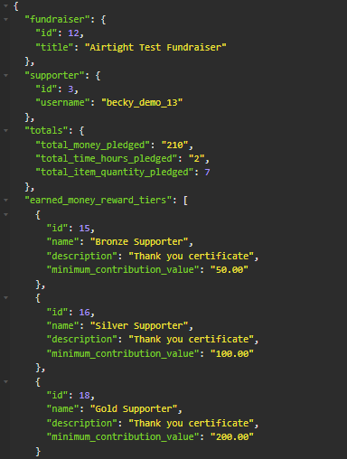

### Time and Item Rewards

Time and item needs may have reward tiers assigned directly on the need:

#### ItemNeed:

- donation_reward_tier

- loan_reward_tier

#### TimeNeed:

- reward_tier

Each time a supporter creates or updates a TimePledge or ItemPledge, the backend:

- Retrieves the reward tier attached to the relevant need.

- Stamps it onto the parent Pledge.reward_tier.

- That pledge now counts toward that reward in the summary.

### Key Behaviour

If a fundraiser owner adds or changes a reward tier after pledges already exist:

- Existing time/item pledges do NOT update automatically.

- New pledges will receive the new reward.

- Owners may edit an ItemPledge/TimePledge to trigger an update.

Example: A supporter can accrue multiple types of rewards.

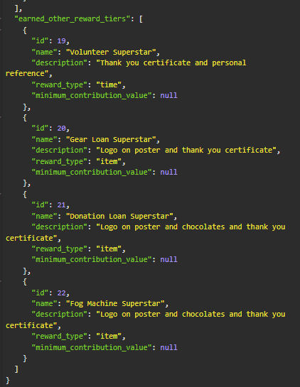

Multiple needs can share the same item or time reward tier (e.g. fog machine and microphone both granting ‘Gear Loan Superstar’).

A supporter who fulfills several such needs will still see the reward tier listed once in their summary, but their total pledged items/hours will reflect all their contributions.

This is to avoid obvious duplication of rewards given.

## Recommended Flow For Users

1. Create your fundraiser
2. Create all your needs (with option to add reward when initially creating need)
3. Create your rewards
4. Attach your rewards to needs (unless already created when need was made)
5. Start accepting pledges

Alternatively, if you have a clear idea of what rewards you want to give before you have written your needs, you can create your rewards first, then update the needs with the corresponding reward_tier id as you go. This is a faster way updating the app.

## Fundraiser Templates (Owner Tools)

Fundraiser templates are a shortcut for organisers who regularly run similar events  
(e.g. “Backyard BBQ”, “School Trivia Night”, “Charity Gig”).

A template stores:

- A “template fundraiser” (title, description, goal, dates, etc.)
- A set of base Needs (money / time / item)
- The detail Need records (MoneyNeed, TimeNeed, ItemNeed)
- Any reward tiers attached to those needs

You can then apply that template to a brand new fundraiser, and the backend will:

- Clone all needs (base + detail) from the template
- Clone all reward tiers
- Wire the cloned needs + rewards to the **new** fundraiser
- Leave pledges out of it (templates never carry pledges)

This lets you spin up a fully pre-configured fundraiser in one request.

### How templates are used (owner flow)

#### 1. Create a template (POST)

Define a reusable pattern that includes a base fundraiser.

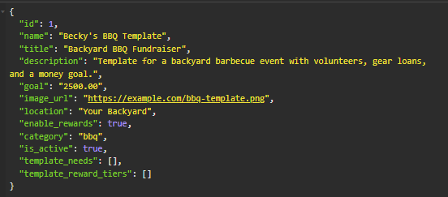

#### 2. Create template reward tiers (POST)

This step is where you decide what rewards to allocate in your new fundraiser template. You can create rewards for all three need types (money, item, time) using this same URL.

**Important:** if you want to create a money reward, you need to set a minimum contribution value. Fields such as max_backers (how many rewards can be allocated per fundraiser) and sort_order (order ranking) are optional for all rewards. This step is interchangeable with doing template needs first, however if you get the rewards done first, they will show up once you POST template needs.

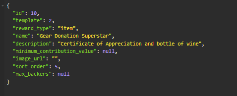

#### 3. Create your template needs (POST)

Define a reusable pattern of templated base and detailed needs. All three need types (money, time, items) can use the same template.

Note in the example below, that once posted, the rewards that were defined in the last step are married up with the needs.

This means once created, you will have a fundraiser, with needs and relevant rewards attached.

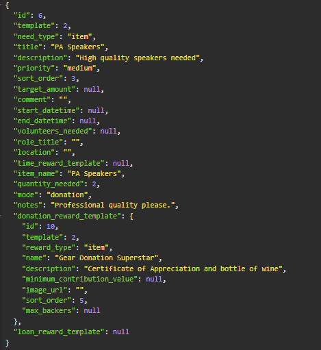

#### 4. Create a new blank fundraiser (POST)

Use `POST /fundraisers/` to create the live fundraiser you want to run  
(e.g. “BBQ for School Music Program”).  
At this point, it should **not** have any needs or reward tiers yet.

#### 5. Apply the template to the new fundraiser

Call:

```http
POST /fundraisers/apply-template/
```

Paste in your fundraiser_id and template_id as shown:


This is where:

- "id" is the new fundraiser you just created
- "template_id" is the ID of the template you want to copy from

#### 6. Edit and customise

After applying the template, you can adjust:

- Titles, dates, or goal

- Targets on MoneyNeeds

- Volunteer numbers or shift times

- Item quantities, modes, or attached rewards

All changes now affect only this new fundraiser, not the original template.

#### Safety rules

To avoid confusing or destructive behaviour, the backend enforces that you cannot apply a template to a fundraiser that already has:

- existing needs, or

- existing reward tiers

If you try, the endpoint returns a **400 Bad Request** with an explanation,
instead of silently duplicating or overwriting anything.

This means it’s safe to call apply-template exactly once per new fundraiser.

## How to register a new user and create a new fundraiser

### 1. Register a new user

#### Endpoint:

- Method: POST
- URL: /users/

Ensure JSON has fields including:

- username
- password
- first_name
- last_name
- email

#### Expected response

- Status: 201 Created
- Body: JSON with the new user’s data (ID, username, email, etc. – password will not be returned).


### 2. Obtain an authentication token

#### Endpoint:

- Method: POST
- URL: /api-token-auth/

#### Expected response

- Status: 200 OK
- Body: JSON containing token field
- Copy token

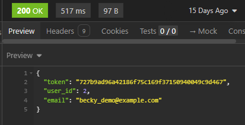

### 3. Copy and paste authentication token in auth tab in Insomnia

- Select 'Auth' tab in Insomnia
- Choose 'Bearer Token' from drop down list
- Paste token and write "Token" under prefix.

### 4. Use the token in authenticated requests

- Use this token to create any endpoint that requires a logged in user (eg. creating a fundraiser, pledging etc)

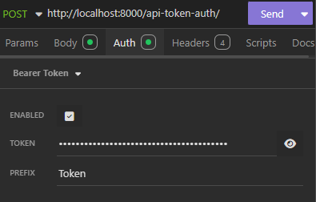

### 5. Create a new fundraiser

#### Endpoint

- Method: POST
- URL: /fundraisers/
- Ensure correct token is inserted into Auth
- POST as shown below using JSON in the body.

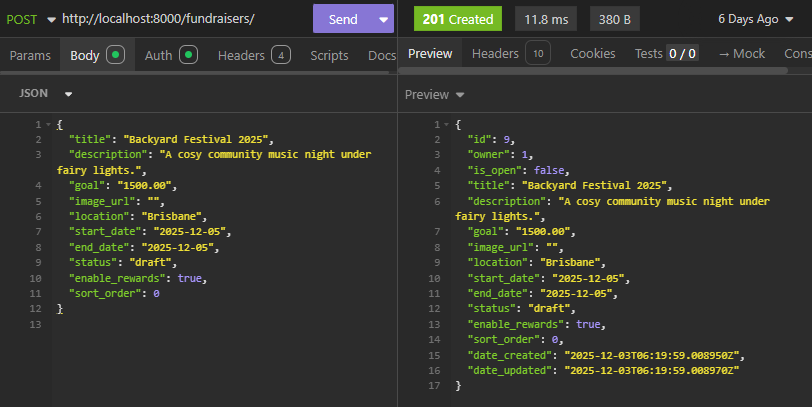

#### Expected response

- Status: 201 Created
- Body: JSON representing the new fundraiser, including its id and the owner set to the logged-in user.

### 6. Create base Needs (required before adding detailed money/time/item needs)

Every money, time, or item need sits on top of a base Need.

#### Imagine it like this:

Fundraiser → Need (“What kind of need is this?”) → Detail (“How much money / time / items?”)

In the front end, the base Need and Need detail tables will be shown on the one card so there will not be any extra user difficulty in using the app.

#### Endpoint:

- Method: POST
- URL: /needs/
- Auth: Required (owner of fundraiser only)

#### Base money Need

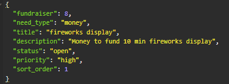

#### Base time Need

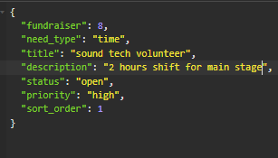

#### Base item Need

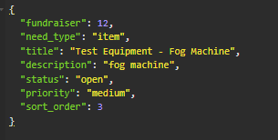

#### Important:

You will need the id of this base Need (e.g. 28) when you create the matching MoneyNeed / TimeNeed / ItemNeed.

Repeat this for each need you want:

- One base need for each money requirement

- One base need for each volunteer/time requirement

- One base need for each item requirement.

### 7. Create detail Needs (money, time, item)

Once you have base Needs, you create the detail records that plug in the specifics (amounts, hours, quantities, reward tiers).

Each detail need must reference an existing base Need via its need field.

#### MoneyNeed

#### Endpoint:

- Method: POST
- URL: /money-needs/
- Auth: required.

This ties the “money detail” to the base Need.

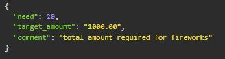

#### TimeNeed

Method: POST
URL: /time-needs/

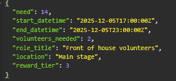

#### Important:

Note that you can attach a reward tier (in this case reward_tier 3) when finalising your time Need. If you choose to leave reward_tier as null and want to come back and alter rewards later, there is functionality for you to create PUT requests for all money/time/item needs before fundraiser deployment and taking pledges.

#### ItemNeed

Method: POST
URL: /item-needs/

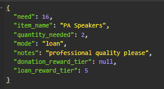

#### Important:

Note that you can choose the "mode" or selecting either LOAN, DONATION OR EITHER when setting your item need. You can also set what reward tier you want to either a donated or loaned item. In the example above, the mode LOAN was selected and loan_reward_tier of 5 was set. In the rewards tier section, you will need to ensure that the reward (in this case 5) has the correct reward_type selected (item).

In short:

- Create the ItemNeed with donation_reward_tier / loan_reward_tier = null,

- Then come back and attach reward tiers once you’ve finished designing your rewards (using PUT),

- As long as you do this before supporters start pledging, everything lines up cleanly.

### 8. Create reward tiers

Method: POST
URL: /reward-tiers/

#### Money reward

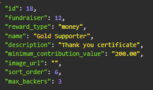

#### Important:

You can set multiple money rewards with different minimum contribution values if you want supporters to get tiered rewards eg a Bronze Certificate for $50 contributed, Silver for $100 and Gold for $200.

#### Time reward

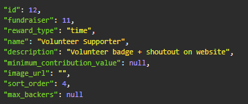

#### Item reward

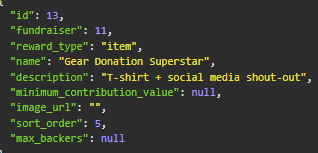

Owners can update rewards up until pledging begins. If a pledge has been made and rewards are updated, the supporter will not retroactively receive the new reward.

### 9. How pledging works

Pledging in Backyard Festival mirrors how real community events work: supporters choose a specific need and contribute money, time, or items to help fulfil it. While the backend uses a two-step pledge model (base pledge → detail pledge), the user experience is simple and intuitive.

#### 1. Browsing Needs

Supporters can view all needs for a fundraiser, grouped into:

- Money needs (funds for a specific purpose)
- Time needs (volunteer roles or shifts)
- Item needs (equipment or supplies to donate or loan)

Each need displays its title, description, target amount/quantity, and any attached rewards.

#### 2. Selecting a Need and Starting a Pledge

When supporters find a need they want to help with, they click Pledge.

They can choose:

- How much money to give
- How many hours they can volunteer
- How many items they can donate or loan
- Supporters may also choose to pledge anonymously.

#### 3. Submitting the Pledge

Submitting a pledge creates:

- A base pledge (supporter → fundraiser → need)
- A detail pledge (money/time/item)

To the supporter, this appears as a single action.
Behind the scenes, this structure keeps the data model clean and flexible.

#### 4. How Rewards Are Assigned

Reward behaviour depends on the type of pledge:

#### Money

- Based on the supporter’s total money pledged for that fundraiser
- Fully retroactive
- Supporters automatically earn any tier where their total meets the threshold
- Editing money pledges updates reward eligibility instantly

#### Time

- Determined by the TimeNeed’s reward tier
- Applied the moment the TimePledge is created
- Changing reward tiers later will not update past pledges

#### Item

- Depends on whether the supporter chooses loan or donation
- Uses the loan_reward_tier or donation_reward_tier on the ItemNeed
- Stamped onto the pledge at creation or update

All earned rewards appear through:

#### `GET /reports/fundraisers/<id>/my-rewards/`

- Total money

- Total hours

- Total items

- Earned money tiers

- Earned time/item tiers

#### 5. Editing or Deleting Pledges

Supporters can:

- Edit their pledge amounts/hours/quantities
- Update time or item pledges to re-trigger reward stamping
- Delete pledges as long as their status is still pending
- Money edits simply update totals, which may adjust reward tiers dynamically.

#### 6. Multiple Pledges Are Allowed

Supporters may:

- Pledge multiple times to the same need
- Pledge to many different needs in one fundraiser
- Support multiple fundraisers

All contributions accumulate toward totals and money reward thresholds.

#### 7. When a Fundraiser Ends

Once a fundraiser closes:

- New pledges cannot be created
- Supporters retain full visibility of all past contributions and rewards
- Organisers can still access all reporting endpoints

This mirrors real crowdfunding platforms, ensuring transparency while preventing last-minute changes.

### 10. Pledge to Needs (API Reference)

Pledging in Backyard Festival is a two-step process:

1. Create a base Pledge (which links supporter → fundraiser → need)

2. Create the detail pledge (MoneyPledge / TimePledge / ItemPledge) that holds the specific contribution data

This design keeps the core pledge model consistent while allowing flexible detail types for money, time, and items.

### 10.1 - Create the base Pledge

Method: POST
URL: /pledges/
Auth: Supporter (logged-in user)

Example

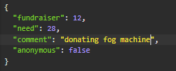

#### What this does:

Creates a Pledge that ties:

- the current SUPPORTER to a specific FUNDRAISER and a specific NEED (base Need ID)

At this point, reward_tier on the pledge is still null and no money/time/item-specific data has been stored yet.

#### Important:

You must create this base pledge before creating any MoneyPledge / TimePledge / ItemPledge.

### 10.2 - Create the Pledge Detail (money/time/item)

Once the base pledge exists, the supporter creates a detail pledge depending on the type of need:

- MoneyNeed → MoneyPledge

- TimeNeed → TimePledge

- ItemNeed → ItemPledge

This second step is where:

- the actual amount/hours/quantity is recorded, and

- for time and item, the reward logic is applied.

#### Money Pledge

#### Endpoint

- Method: POST
- URL: /money-pledges/
- Auth: Supporter only

#### Example:


#### Behaviour

- Links money data (amount + comment) to the base pledge.

- Money rewards are not stamped on a per-pledge basis; instead, the total money pledged across all money pledges for that fundraiser is used when calculating earned_money_reward_tiers in GET /my-rewards/.

- Because of this, money rewards are fully retroactive – changing thresholds or adding money reward tiers later will update what supporters qualify for.

#### Time Pledge

#### Endpoint

- Method: POST
- URL: /time-pledges/
- Auth: Supporter only

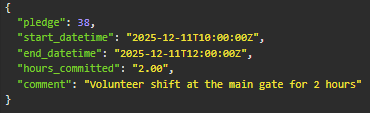

#### Behaviour

- Creates a TimePledge linked to the base pledge.

- The TimePledgeSerializer runs backend logic that:

  - Looks up the associated TimeNeed (via the base pledge’s need)

  - Reads any reward_tier attached to that TimeNeed

- If a tier is set, stamps it onto Pledge.reward_tier

This is the moment when time rewards are applied.

#### Important:

- If the TimeNeed did not have a reward tier set at the time the TimePledge was created, the pledge won’t receive a reward.

- If you later add or change a reward tier on the TimeNeed, existing time pledges will not auto-update; you would need to update those TimePledges (e.g. via PUT) to re-run the reward logic.
-

#### Item Pledge

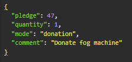

#### Behaviour

- Creates an ItemPledge linked to the base pledge.

- The ItemPledgeSerializer runs backend logic that:

  - Follows item_pledge.pledge.need to get the base Need

  - Finds the associated ItemNeed detail

  - Chooses the correct reward tier based on:

    - mode == "donation" → uses donation_reward_tier
    - mode == "loan" → uses loan_reward_tier

  - If a tier is set, stamps it onto Pledge.reward_tier

  - This is the moment when item rewards are applied.

Important:

- Item rewards are attached based on the reward tiers present on the ItemNeed at the time the ItemPledge is created or updated.

- Adding/changing reward tiers on the ItemNeed after pledges exist will only affect future ItemPledges (or existing ones if they are edited).
- Reward stamping for item/time occurs here, at the moment the detailed pledge is created.

### 11. Viewing earned rewards & how the rewards summary works

Supporters can view their totals and rewards for a **single fundraiser** using:

- `GET /reports/fundraisers/<id>/my-rewards/`

This endpoint returns, for the logged-in supporter:

- Total money pledged
- Total time committed
- Total items pledged
- `earned_money_reward_tiers` (dynamic, threshold-based)
- `earned_other_reward_tiers` (time + item rewards, based on stamped `Pledge.reward_tier`)

Behind the scenes, the summary works in three parts:

#### 1. Money rewards (dynamic, threshold-based)

Money rewards are always recalculated based on the supporter’s total money pledged across all `MoneyPledge` objects for that fundraiser.

- Adding new money reward tiers → instantly reflected
- Editing thresholds → instantly reflected
- Editing or deleting past money pledges → instantly reflected

This behaves like Kickstarter-style tiers:  
If a supporter crosses a new tier threshold, they immediately gain that tier.

#### 2. Time and item rewards (stamped at creation or update)

Time and item rewards do **not** recalculate dynamically.

They are applied using reward stamping:

- When a `TimePledge` or `ItemPledge` is created
- Or when it is updated via `PUT`

At that moment, the backend:

- Looks up the associated `TimeNeed` or `ItemNeed`
- Reads the relevant reward tier (`time_reward_tier`, `donation_reward_tier`, or `loan_reward_tier`)
- Writes it to `Pledge.reward_tier`

Changing reward tiers on needs later will **not** automatically change older pledges.  
To re-evaluate rewards, you’d need to update those pledges (e.g. via `PUT`).

#### 3. Totals returned by the endpoint

The summary endpoint calculates:

- `total_money_pledged` – sum of all `MoneyPledge.amount` values
- `total_time_hours_pledged` – sum of all `TimePledge.hours_committed`
- `total_item_quantity_pledged` – sum of all `ItemPledge.quantity` values

It also returns:

- `earned_money_reward_tiers` (money tiers where the supporter’s total meets the minimum contribution)
- `earned_other_reward_tiers` (distinct time/item reward tiers stamped on pledges)

This lets supporters see both:

- Their **tiered rewards** for money (Bronze / Silver / Gold etc.), and
- Their **specific recognition** for volunteering or lending/donating gear.

##### Example

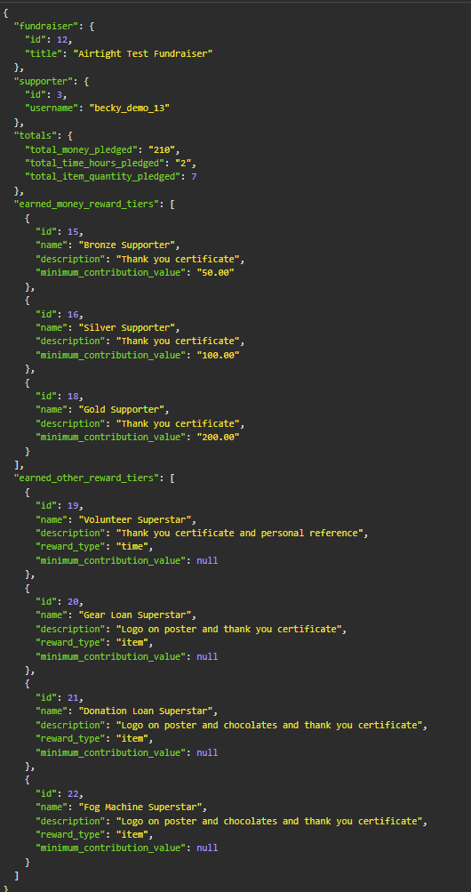

# API Specifications

## How the composition works:

Need (base) → MoneyNeed / TimeNeed / ItemNeed  
Pledge (base) → MoneyPledge / TimePledge / ItemPledge

## Users and Authentication

All endpoints return and accept JSON.  
Authentication is via **Token Auth** using:

- `POST /api-token-auth/` with `username` and `password`
- In Insomnia: Auth = Bearer Token, Token = <your-token>, Prefix = Token
  (This produces Authorization: Token <your-token>)

| URL                | Method | Purpose                         | Request Body                    | Success | Auth  |
| ------------------ | ------ | ------------------------------- | ------------------------------- | ------- | ----- |
| `/users/`          | POST   | Register new user               | `username`, `email`, `password` | 201     | None  |
| `/users/`          | GET    | List users                      | –                               | 200     | Admin |
| `/api-token-auth/` | POST   | Obtain token for authentication | `username`, `password`          | 200     | None  |

### Example: Get Users (GET/users)


### Example: Create Users (POST/users)

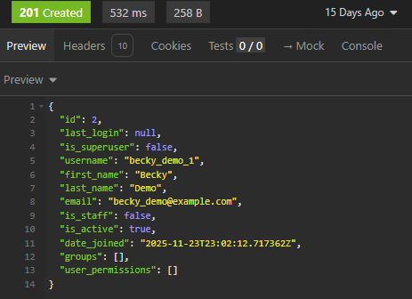

### Example: Get Token (POST/api-token-auth/)


## Fundraisers

| URL                  | Method | Purpose                                | Request Body                                                                                                                | Success | Auth       |
| -------------------- | ------ | -------------------------------------- | --------------------------------------------------------------------------------------------------------------------------- | ------- | ---------- |
| `/fundraisers/`      | GET    | List all fundraisers                   | –                                                                                                                           | 200     | None       |
| `/fundraisers/`      | POST   | Create a fundraiser                    | `title`, `description`, `goal`, `image_url`, `location`, `start_date`, `end_date`, `status`, `enable_rewards`, `sort_order` | 201     | Logged-in  |
| `/fundraisers/<id>/` | GET    | Retrieve a single fundraiser           | –                                                                                                                           | 200     | None       |
| `/fundraisers/<id>/` | PUT    | Update fundraiser                      | Same fields as POST (partial updates allowed on PUT)                                                                        | 200     | Owner only |
| `/fundraisers/<id>/` | DELETE | Delete fundraiser (only if no pledges) | –                                                                                                                           | 204     | Owner only |

### Example: Create Fundraiser (POST `/fundraisers/`)

```json
{
  "title": "Backyard Festival 2025",
  "description": "A mini community festival with music, food and games.",
  "goal": "5000.00",
  "image_url": "https://example.com/festival.jpg",
  "location": "Brisbane backyard, West End",
  "start_date": "2025-12-05",
  "end_date": "2025-12-05",
  "status": "active",
  "enable_rewards": true,
  "sort_order": 1
}
```

### Example: Get Fundraiser (GET/fundraisers)

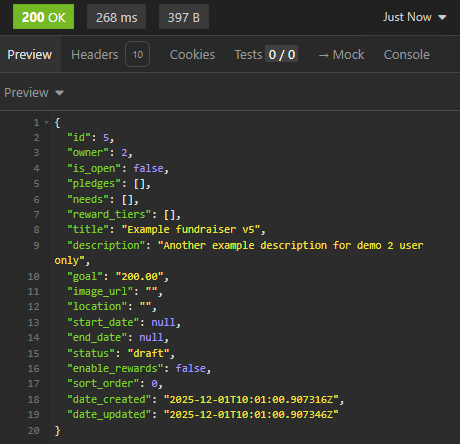

### Example: Create Fundraiser (POST/fundraisers/)

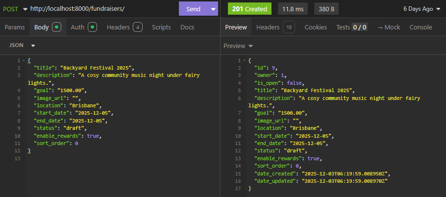

## Needs (Base Need)

| URL                       | Method | Purpose                          | Request Body                                                                          | Success | Auth             |
| ------------------------- | ------ | -------------------------------- | ------------------------------------------------------------------------------------- | ------- | ---------------- |
| `/needs/`                 | GET    | List all needs                   | –                                                                                     | 200     | None             |
| `/needs/`                 | POST   | Create a base need               | `fundraiser`, `need_type`, `title`, `description`, `status`, `priority`, `sort_order` | 201     | Fundraiser owner |
| `/needs/?fundraiser=<id>` | GET    | List needs for fundraiser        | -                                                                                     | 200     | None             |
| `/needs/<id>/`            | GET    | Retrieve a single need           | –                                                                                     | 200     | None             |
| `/needs/<id>/`            | PUT    | Update need                      | Same fields as POST (partial updates allowed on PUT)                                  | 200     | Fundraiser owner |
| `/needs/<id>/`            | DELETE | Delete need (only if no pledges) | –                                                                                     | 204     | Fundraiser owner |

### Example: Create Need (POST/needs)

```json
{
  "fundraiser": 8,
  "need_type": "money",
  "title": "Money for pizza and beer for the crew",
  "description": "Pepperoni and pineapple all round!",
  "status": "open",
  "priority": "high",
  "sort_order": 1
}
```

### Example: Get Needs (GET/needs)


### Example: Post Needs (POST/needs)

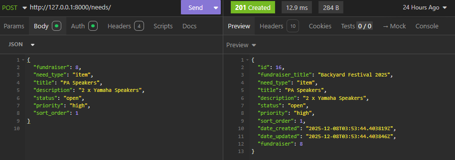

## Need Detail Models

These add extra fields for each type of need.
Each is linked by a OneToOne relationship to a base Need.

### Money Need

| URL                  | Method | Purpose              | Request Body                       | Success | Auth             |
| -------------------- | ------ | -------------------- | ---------------------------------- | ------- | ---------------- |
| `/money-needs/`      | GET    | List all money needs | –                                  | 200     | None             |
| `/money-needs/`      | POST   | Create MoneyNeed     | `need`, `target_amount`, `comment` | 201     | Fundraiser owner |
| `/money-needs/<id>/` | GET    | Retrieve MoneyNeed   | –                                  | 200     | None             |
| `/money-needs/<id>/` | PUT    | Update MoneyNeed     | `target_amount`, `comment`         | 200     | Fundraiser owner |
| `/money-needs/<id>/` | DELETE | Delete MoneyNeed     | –                                  | 204     | Fundraiser owner |

### Example Create Money Need (POST/money-needs)

```json
{
  "need": 8,
  "target_amount": "600.00",
  "comment": "Total amount for pizza for the crew."
}
```

### Example: Get Money Need (GET/money-needs)


### Example: Create Money Need (POST/money-needs)


## Time Need

| URL                 | Method | Purpose             | Request Body                                                                                                      | Success | Auth             |
| ------------------- | ------ | ------------------- | ----------------------------------------------------------------------------------------------------------------- | ------- | ---------------- |
| `/time-needs/`      | GET    | List all time needs | –                                                                                                                 | 200     | None             |
| `/time-needs/`      | POST   | Create TimeNeed     | `need`, `role_title`, `location`, `start_datetime`, `end_datetime`, `volunteers_needed`, `reward_tier (optional)` | 201     | Fundraiser owner |
| `/time-needs/<id>/` | GET    | Retrieve TimeNeed   | –                                                                                                                 | 200     | None             |
| `/time-needs/<id>/` | PUT    | Update TimeNeed     | Same as POST                                                                                                      | 200     | Fundraiser owner |
| `/time-needs/<id>/` | DELETE | Delete TimeNeed     | –                                                                                                                 | 204     | Fundraiser owner |

### Example: GET Time Needs (GET/time-needs)


### Example: POST Time Needs (POST/time-needs)


### Item Need

| URL                 | Method | Purpose             | Request Body                                                                                                                                                                      | Success | Auth             |
| ------------------- | ------ | ------------------- | --------------------------------------------------------------------------------------------------------------------------------------------------------------------------------- | ------- | ---------------- |
| `/item-needs/`      | GET    | List all item needs | –                                                                                                                                                                                 | 200     | None             |
| `/item-needs/`      | POST   | Create ItemNeed     | `need`, `item_name`, `quantity_needed`, `mode (choices - "donation", "loan" and "either")`, `notes (optional)`, `donation_reward_tier (optional)`, `loan_reward_tier (optional) ` | 201     | Fundraiser owner |
| `/item-needs/<id>/` | GET    | Retrieve ItemNeed   | –                                                                                                                                                                                 | 200     | None             |
| `/item-needs/<id>/` | PUT    | Update ItemNeed     | Same as POST                                                                                                                                                                      | 200     | Fundraiser owner |
| `/item-needs/<id>/` | DELETE | Delete ItemNeed     | –                                                                                                                                                                                 | 204     | Fundraiser owner |

### Example: Get Item Needs (GET/item-needs)


### Example: Create Item Needs (POST/item-needs)


## Pledges

### Base Pledge

| URL              | Method | Purpose           | Request Body                                 | Success | Auth                                   |
| ---------------- | ------ | ----------------- | -------------------------------------------- | ------- | -------------------------------------- |
| `/pledges/`      | GET    | List all pledges  | –                                            | 200     | Public                                 |
| `/pledges/`      | POST   | Create a pledge   | `fundraiser`, `need`, `comment`, `anonymous` | 201     | Logged-in                              |
| `/pledges/<id>/` | GET    | Retrieve a pledge | –                                            | 200     | Supporter or Fundraiser owner          |
| `/pledges/<id>/` | PUT    | Update pledge     | `comment`, `anonymous`                       | 200     | Supporter only                         |
| `/pledges/<id>/` | DELETE | Delete pledge     | –                                            | 204     | Supporter (only if `status = pending`) |

### Example: Get Pledge (GET/pledges)


### Example: Create Pledges (POST/pledges)


## Pledge Detail Models

### Money Pledge

| URL                    | Method | Purpose              | Request Body                  | Success | Auth                          |
| ---------------------- | ------ | -------------------- | ----------------------------- | ------- | ----------------------------- |
| `/money-pledges/`      | POST   | Create MoneyPledge   | `pledge`, `amount`, `comment` | 201     | Supporter only                |
| `/money-pledges/`      | GET    | List MoneyPledges    | –                             | 200     | Supporter or Fundraiser owner |
| `/money-pledges/<id>/` | GET    | Retrieve MoneyPledge | –                             | 200     | Supporter or Fundraiser owner |
| `/money-pledges/<id>/` | PUT    | Update MoneyPledge   | `amount`, `comment`           | 200     | Supporter only                |
| `/money-pledges/<id>/` | DELETE | Delete MoneyPledge   | –                             | 204     | Supporter only                |

### Example: Get Money Pledge (GET/money-pledges)


### Example: Create Money Pledge (POST/money-pledges)

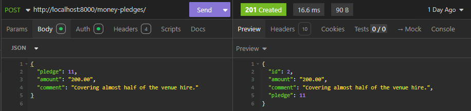

### Time Pledge

| URL                   | Method | Purpose             | Request Body                                                                        | Success | Auth                          |
| --------------------- | ------ | ------------------- | ----------------------------------------------------------------------------------- | ------- | ----------------------------- |
| `/time-pledges/`      | POST   | Create TimePledge   | `pledge`, `start_datetime`, `end_datetime`, `hours_committed`, `comment (optional)` | 201     | Supporter only                |
| `/time-pledges/`      | GET    | List TimePledges    | –                                                                                   | 200     | Supporter or Fundraiser owner |
| `/time-pledges/<id>/` | GET    | Retrieve TimePledge | –                                                                                   | 200     | Supporter or Fundraiser owner |
| `/time-pledges/<id>/` | PUT    | Update TimePledge   | Same as POST                                                                        | 200     | Supporter only                |
| `/time-pledges/<id>/` | DELETE | Delete TimePledge   | –                                                                                   | 204     | Supporter only                |

### Example: Get Time Pledge (GET/time-pledges)


### Example: Create Time Pledges (POST/time-pledges)

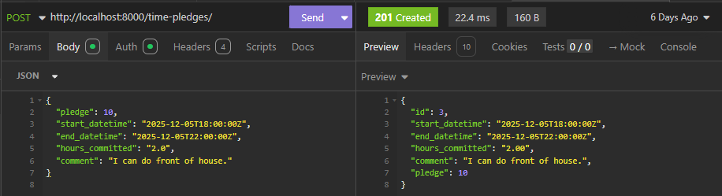

### Item Pledge

| URL                   | Method | Purpose             | Request Body                                                              | Success | Auth                          |
| --------------------- | ------ | ------------------- | ------------------------------------------------------------------------- | ------- | ----------------------------- |
| `/item-pledges/`      | POST   | Create ItemPledge   | `pledge`, `quantity`, `mode ("donation" or "loan")`, `comment (optional)` | 201     | Supporter only                |
| `/item-pledges/`      | GET    | List ItemPledges    | –                                                                         | 200     | Supporter or Fundraiser owner |
| `/item-pledges/<id>/` | GET    | Retrieve ItemPledge | –                                                                         | 200     | Supporter or Fundraiser owner |
| `/item-pledges/<id>/` | PUT    | Update ItemPledge   | Same fields as POST                                                       | 200     | Supporter only                |
| `/item-pledges/<id>/` | DELETE | Delete ItemPledge   | –                                                                         | 204     | Supporter only                |

### Example: Get Item Pledge (GET/item-pledges)

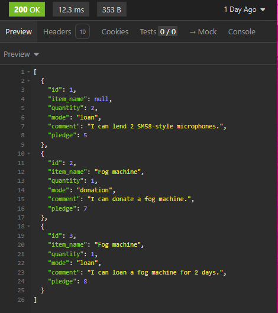

### Example: Create Item Pledges (POST/item-pledges)

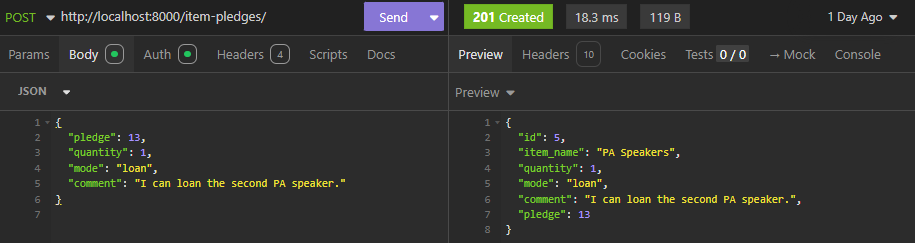

### Reward Tiers

Reward tiers belong to a fundraiser and can be linked to TimeNeed and ItemNeed (separate tiers for donation vs loan).
They can also be attached to pledges (for money, time, or item pledges) so supporters receive bonuses when pledging.

| URL                   | Method | Purpose             | Request Body                                                                                                                                                                              | Success | Auth             |
| --------------------- | ------ | ------------------- | ----------------------------------------------------------------------------------------------------------------------------------------------------------------------------------------- | ------- | ---------------- |
| `/reward-tiers/`      | GET    | List reward tiers   | –                                                                                                                                                                                         | 200     | None             |
| `/reward-tiers/`      | POST   | Create RewardTier   | `fundraiser`, `name`, `description`, `reward_type ("money", "time", "item", default "money")`, `minimum_contribution_value (for money rewards)`, `image_url`, `sort_order`, `max_backers` | 201     | Fundraiser owner |
| `/reward-tiers/<id>/` | GET    | Retrieve RewardTier | –                                                                                                                                                                                         | 200     | None             |
| `/reward-tiers/<id>/` | PUT    | Update RewardTier   | Same as POST                                                                                                                                                                              | 200     | Fundraiser owner |
| `/reward-tiers/<id>/` | DELETE | Delete RewardTier   | –                                                                                                                                                                                         | 204     | Fundraiser owner |

### Example: Get Reward Tier (GET/reward-tiers/)


### Example: Create Reward Tier (POST/reward-tiers/)


## Fundraiser Templates

Fundraiser templates let organisers define reusable starter configurations and apply them to new fundraisers.

Applying a template copies needs and reward tiers into the selected fundraiser.
Any edits made afterward affect only the new fundraiser, not the original template.

Templates are publicly browseable, allowing organisers to preview available starter configurations before choosing one.

Templates are publicly browseable (active templates only). Creating, editing, and deleting templates is restricted to staff/admin users.

| URL                           | Method | Purpose                          | Request Body                         | Success | Auth                            |
| ----------------------------- | ------ | -------------------------------- | ------------------------------------ | ------- | ------------------------------- |
| `/fundraiser-templates/`      | GET    | List all fundraiser templates    | –                                    | 200     | Public (lists active templates) |
| `/fundraiser-templates/`      | POST   | Create a new fundraiser template | Template fields (as for fundraisers) | 201     | Staff/admin only                |
| `/fundraiser-templates/<id>/` | GET    | Retrieve a single template       | –                                    | 200     | Public                          |
| `/fundraiser-templates/<id>/` | PUT    | Update a template                | Same fields as POST                  | 200     | Staff/admin only                |
| `/fundraiser-templates/<id>/` | DELETE | Delete a template                | –                                    | 204     | Staff/admin only                |

Future improvements: support user-created templates; restrict edits/deletes to template owners.

## Template Reward Tiers

Template reward tiers act as blueprints for real RewardTier objects when a template is applied.

| URL                            | Method | Purpose                         | Request Body                                                                                                 | Success | Auth             |
| ------------------------------ | ------ | ------------------------------- | ------------------------------------------------------------------------------------------------------------ | ------- | ---------------- |
| `/template-reward-tiers/`      | GET    | List all template reward tiers  | –                                                                                                            | 200     | Public           |
| `/template-reward-tiers/`      | POST   | Create a template reward tier   | `template`, `reward_type`, `name`, `description`, `minimum_contribution_value` (money only), optional fields | 201     | Staff/admin only |
| `/template-reward-tiers/<id>/` | GET    | Retrieve a template reward tier | –                                                                                                            | 200     | Public           |
| `/template-reward-tiers/<id>/` | PUT    | Update a template reward tier   | Same fields as POST                                                                                          | 200     | Staff/admin only |
| `/template-reward-tiers/<id>/` | DELETE | Delete a template reward tier   | –                                                                                                            | 204     | Staff/admin only |

## Template Needs

Template needs define reusable base and detailed needs (money, time, item) that will be cloned into a fundraiser.

| URL                     | Method | Purpose                  | Request Body                                                                         | Success | Auth             |
| ----------------------- | ------ | ------------------------ | ------------------------------------------------------------------------------------ | ------- | ---------------- |
| `/template-needs/`      | GET    | List all template needs  | –                                                                                    | 200     | Public           |
| `/template-needs/`      | POST   | Create a template need   | `template`, `need_type`, base fields + subtype fields + optional reward template ids | 201     | Staff/admin only |
| `/template-needs/<id>/` | GET    | Retrieve a template need | –                                                                                    | 200     | Public           |
| `/template-needs/<id>/` | PUT    | Update a template need   | Same fields as POST                                                                  | 200     | Staff/admin only |
| `/template-needs/<id>/` | DELETE | Delete a template need   | –                                                                                    | 204     | Staff/admin only |

## Apply Template to Fundraiser

| URL                            | Method | Purpose                                          | Request Body                               | Success | Auth                           |
| ------------------------------ | ------ | ------------------------------------------------ | ------------------------------------------ | ------- | ------------------------------ |
| `/fundraisers/apply-template/` | POST   | Apply a template to an existing empty fundraiser | `{ "fundraiser_id": X, "template_id": Y }` | 200     | Logged in and Fundraiser owner |

## Reporting Endpoints

### Fundraiser Summary

| URL                                  | Method | Purpose                                 | Request Body | Success | Auth |
| ------------------------------------ | ------ | --------------------------------------- | ------------ | ------- | ---- |
| `/reports/fundraisers/<id>/summary/` | GET    | Returns full dashboard for a fundraiser | –            | 200     | None |

### Need Progress

| URL                             | Method | Purpose                                     | Request Body | Success | Auth |
| ------------------------------- | ------ | ------------------------------------------- | ------------ | ------- | ---- |
| `/reports/needs/<id>/progress/` | GET    | Returns progress snapshot for a single need | –            | 200     | None |

### My Fundraisers

| URL                        | Method | Purpose                                   | Request Body | Success | Auth      |
| -------------------------- | ------ | ----------------------------------------- | ------------ | ------- | --------- |
| `/reports/my-fundraisers/` | GET    | Lists summaries for all fundraisers I own | –            | 200     | Logged-in |

### Fundraiser Pledges Report

| URL                                  | Method | Purpose                                | Request Body | Success | Auth             |
| ------------------------------------ | ------ | -------------------------------------- | ------------ | ------- | ---------------- |
| `/reports/fundraisers/<id>/pledges/` | GET    | Returns all pledges for the fundraiser | –            | 200     | Fundraiser owner |

### My Pledges

| URL                    | Method | Purpose                                   | Request Body | Success | Auth      |
| ---------------------- | ------ | ----------------------------------------- | ------------ | ------- | --------- |
| `/reports/my-pledges/` | GET    | Returns all pledges made by the supporter | –            | 200     | Logged-in |

### My Rewards Summary

Returns reward information for the logged-in supporter for a specific fundraiser only, including:

- total money pledged

- total hours pledged

- total items pledged

- earned money reward tiers (dynamic and threshold-based)

- earned time/item reward tiers (based on reward stamping on pledges)

This endpoint mirrors what a supporter would see in a personal “Rewards Dashboard” for that fundraiser.

| URL                                     | Method | Purpose                                                           | Request Body | Success | Auth      |
| --------------------------------------- | ------ | ----------------------------------------------------------------- | ------------ | ------- | --------- |
| `/reports/fundraisers/<id>/my-rewards/` | GET    | Returns totals + earned reward tiers **for that fundraiser only** | –            | 200     | Logged-in |

### DB Schema

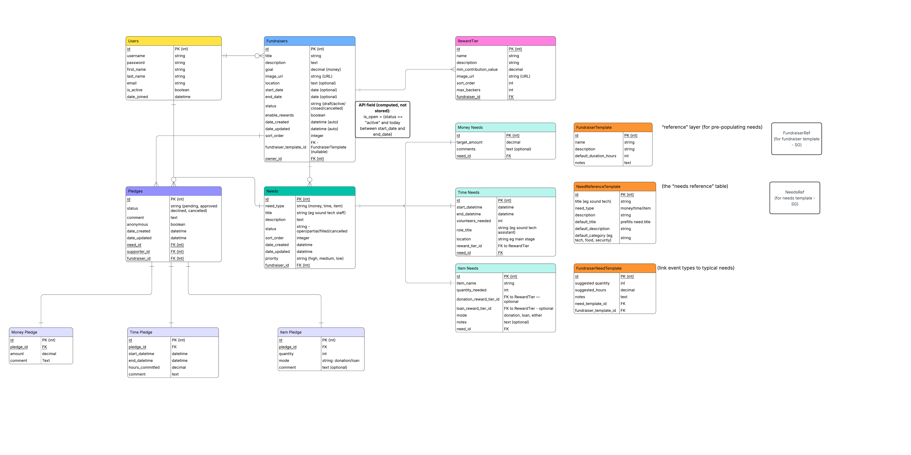
