# Crowdfunding Back End - Backyard Festival

Created by Becky Cole

Deployed API: https://backyard-festival-62ea19175310.herokuapp.com/fundraisers/

## Planning:

### Backyard Festival – Crowdfunding Platform for Events on a Shoestring!

Backyard Festival is a full-stack crowdfunding platform designed to help event organisers run grassroots/small-to-medium community events such as local music concerts, bachelorette parties, Church functions, school fundraisers, street marches, charity bike rides etc.

Unlike traditional crowdfunding sites which only support money, Backyard Festival allows supporters to contribute money, items, or time, and lets event hosts assign reward tiers for all three contribution types.

This platform models how micro events work in reality (especially in the not for profit sector), where you need money (eg venue hire), time (volunteers to run the event) and items (e.g. microphones, PA system) to get local events up and running.

Organisers create a fundraiser, define their needs (money, item, or volunteer time), set optional rewards, and supporters can pledge directly against those needs.

It is envisaged that the platform would eventually be a community platform where people can support each other's projects, volunteer for various projects, earn rewards and recommendations from event organisers.

This would long term be invaluable for students wanting to break into events/music who need experience to put on their resume. It also acknowledges that micro-events can often be pulled together through sharing equipment and resources, ultimately with the aim of providing more opportunities for people to create and host more events in the community.

### Intended Audience/User Stories

#### Intended Audience

Community organisers running events (festivals, concerts, school events, charity nights)

- Volunteers wanting to offer skills or time

- Supporters wanting to donate money or items

- Small groups needing a centralised place to coordinate resources

### Key User Stories

As an organiser:

- I want to create a fundraiser and list all the needs required for my event.

- I want to specify whether a need requires money, time, or items.

- I want to attach reward tiers to encourage certain contributions.

- I want to track all pledges and see which needs are filled or still open.

As a supporter:

- I want to browse events and see what they need.

- I want to pledge money, volunteer my time, or loan/donate items.

- I want to see what reward I’ll get for my contribution.

- I want to edit my pledge if my plans or availability change.

## Front End Pages/Functionality (Planned)

- Home / Browse Fundraisers

  - List all open fundraisers
  - Filter by category or location
  - Click through to a fundraiser detail page

- Fundraiser Detail

  - Show fundraiser description, goal, and status
  - Show needs grouped by money / time / items
  - Allow logged-in users to create pledges

- My Dashboard
  - Show fundraisers I own (with progress summaries)
  - Show pledges I’ve made
  - Links to edit / manage needs

## How to register a new user and create a new fundraiser

### 1. Register a new user

#### Endpoint:

- Method: POST
- URL: /users/

Ensure JSON has fields including:

- username
- password
- first_name
- last_name
- email

#### Expected response

- Status: 201 Created
- Body: JSON with the new user’s data (ID, username, email, etc. – password will not be returned).

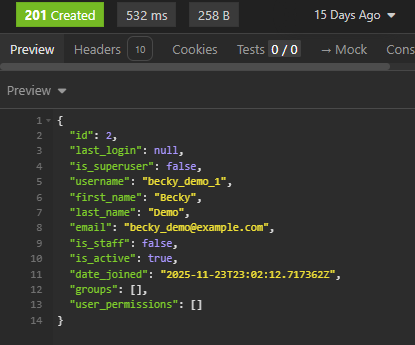

### 2. Obtain an authentication token

#### Endpoint:

- Method: POST
- URL: /api-token-auth/

#### Expected response

- Status: 200 OK
- Body: JSON containing token field
- Copy token


#### 3. Copy and paste authentication token in auth tab in Insomnia

- Select 'Auth' tab in Insomnia
- Choose 'Bearer Token' from drop down list
- Paste token and write "Token" under prefix.

#### 4. Use the token in authenticated requests

- Use this token to create any endpoint that requires a logged in user (eg. creating a fundraiser, pledging etc)


#### 5. Create a new fundraiser

#### Endpoint

- Method: POST
- URL: /fundraisers/
- Ensure correct token is inserted into Auth
- POST as shown below using JSON in the body.


#### Expected response

- Status: 201 Created
- Body: JSON representing the new fundraiser, including its id and the owner set to the logged-in user.

#

# API Specifications

## How the composition works:

Need (base) → MoneyNeed / TimeNeed / ItemNeed  
Pledge (base) → MoneyPledge / TimePledge / ItemPledge

## Users and Authentication

All endpoints return and accept JSON.  
Authentication is via **Token Auth** using:

- `POST /api-token-auth/` with `username` and `password`
- Then send `Authorization: Token <your-token>` in headers for authenticated actions.

| URL                | Method | Purpose                         | Request Body                    | Success | Auth  |
| ------------------ | ------ | ------------------------------- | ------------------------------- | ------- | ----- |
| `/users/`          | POST   | Register new user               | `username`, `email`, `password` | 201     | None  |
| `/users/`          | GET    | List users                      | –                               | 200     | Admin |
| `/api-token-auth/` | POST   | Obtain token for authentication | `username`, `password`          | 200     | None  |

### Example: Get Users (GET/users)

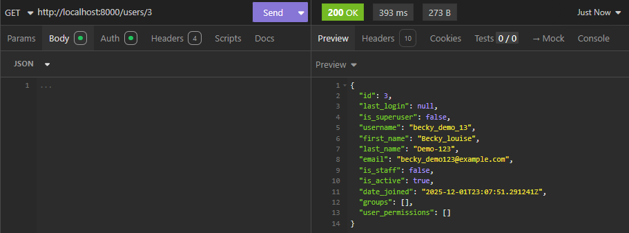

### Example: Create Users (POST/users)


### Example: Get Token (POST/api-token-auth/)

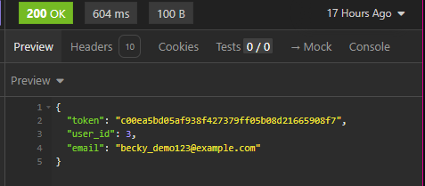

## Fundraisers

| URL                  | Method | Purpose                                | Request Body                                                                                                                | Success | Auth       |
| -------------------- | ------ | -------------------------------------- | --------------------------------------------------------------------------------------------------------------------------- | ------- | ---------- |
| `/fundraisers/`      | GET    | List all fundraisers                   | –                                                                                                                           | 200     | None       |
| `/fundraisers/`      | POST   | Create a fundraiser                    | `title`, `description`, `goal`, `image_url`, `location`, `start_date`, `end_date`, `status`, `enable_rewards`, `sort_order` | 201     | Logged-in  |
| `/fundraisers/<id>/` | GET    | Retrieve a single fundraiser           | –                                                                                                                           | 200     | None       |
| `/fundraisers/<id>/` | PUT    | Update fundraiser                      | Same fields as POST (partial updates allowed)                                                                               | 200     | Owner only |
| `/fundraisers/<id>/` | DELETE | Delete fundraiser (only if no pledges) | –                                                                                                                           | 204     | Owner only |

### Example: Create Fundraiser (POST `/fundraisers/`)

```json
{
  "title": "Backyard Festival 2025",
  "description": "A mini community festival with music, food and games.",
  "goal": "5000.00",
  "image_url": "https://example.com/festival.jpg",
  "location": "Brisbane backyard, West End",
  "start_date": "2025-12-05",
  "end_date": "2025-12-05",
  "status": "active",
  "enable_rewards": true,
  "sort_order": 1
}
```

### Example: Get Fundraiser (GET/fundraisers)


### Example: Create Fundraiser (POST/fundraisers/)


## Needs (Base Need)

| URL                       | Method | Purpose                          | Request Body                                                                          | Success | Auth             |
| ------------------------- | ------ | -------------------------------- | ------------------------------------------------------------------------------------- | ------- | ---------------- |
| `/needs/`                 | GET    | List all needs                   | –                                                                                     | 200     | None             |
| `/needs/`                 | POST   | Create a base need               | `fundraiser`, `need_type`, `title`, `description`, `status`, `priority`, `sort_order` | 201     | Fundraiser owner |
| `/needs/?fundraiser=<id>` | GET    | List needs for fundraiser        | -                                                                                     | 200     | None             |
| `/needs/<id>/`            | GET    | Retrieve a single need           | –                                                                                     | 200     | None             |
| `/needs/<id>/`            | PUT    | Update need                      | Same fields as POST (partial updates allowed)                                         | 200     | Fundraiser owner |
| `/needs/<id>/`            | DELETE | Delete need (only if no pledges) | –                                                                                     | 204     | Fundraiser owner |

### Example: Create Need (POST/needs)

```json
{
  "fundraiser": 8,
  "need_type": "money",
  "title": "Money for pizza and beer for the crew",
  "description": "Pepperoni and pineapple all round!",
  "status": "open",
  "priority": "high",
  "sort_order": 1
}
```

### Example: Get Needs (GET/needs)


### Example: Post Needs (POST/needs)


## Need Detail Models

These add extra fields for each type of need.
Each is linked by a OneToOne relationship to a base Need.

### Money Need

| URL                  | Method | Purpose              | Request Body                       | Success | Auth             |
| -------------------- | ------ | -------------------- | ---------------------------------- | ------- | ---------------- |
| `/money-needs/`      | GET    | List all money needs | –                                  | 200     | None             |
| `/money-needs/`      | POST   | Create MoneyNeed     | `need`, `target_amount`, `comment` | 201     | Fundraiser owner |
| `/money-needs/<id>/` | GET    | Retrieve MoneyNeed   | –                                  | 200     | None             |
| `/money-needs/<id>/` | PUT    | Update MoneyNeed     | `target_amount`, `comment`         | 200     | Fundraiser owner |
| `/money-needs/<id>/` | DELETE | Delete MoneyNeed     | –                                  | 204     | Fundraiser owner |

### Example Create Money Need (POST/money-needs)

```json
{
  "need": 8,
  "target_amount": "600.00",
  "comment": "Total amount for pizza for the crew."
}
```

### Example: Get Money Need (GET/money-needs)

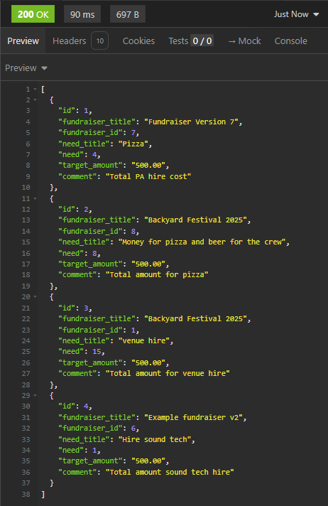

### Example: Create Money Need (POST/money-needs)

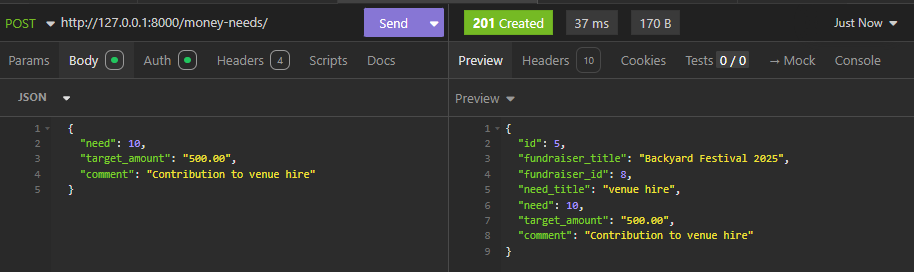

## Time Need

| URL                 | Method | Purpose             | Request Body                                                                                           | Success | Auth             |
| ------------------- | ------ | ------------------- | ------------------------------------------------------------------------------------------------------ | ------- | ---------------- |
| `/time-needs/`      | GET    | List all time needs | –                                                                                                      | 200     | None             |
| `/time-needs/`      | POST   | Create TimeNeed     | `need`, `role_title`, `location`, `start_datetime`, `end_datetime`, `volunteers_needed`, `reward_tier` | 201     | Fundraiser owner |
| `/time-needs/<id>/` | GET    | Retrieve TimeNeed   | –                                                                                                      | 200     | None             |
| `/time-needs/<id>/` | PUT    | Update TimeNeed     | Same as POST                                                                                           | 200     | Fundraiser owner |
| `/time-needs/<id>/` | DELETE | Delete TimeNeed     | –                                                                                                      | 204     | Fundraiser owner |

### Example: GET Time Needs (GET/time-needs)

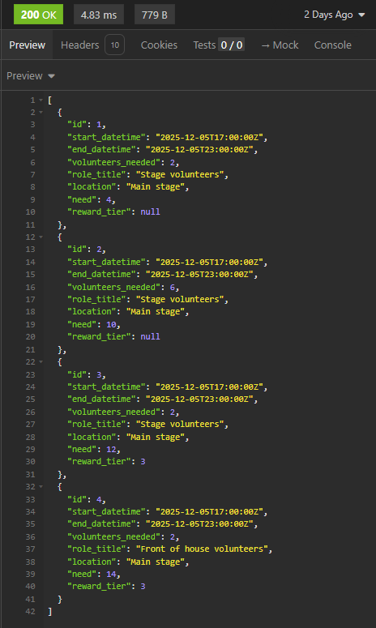

### Example: POST Time Needs (POST/time-needs)


### Item Need

| URL                 | Method | Purpose             | Request Body                                   | Success | Auth             |
| ------------------- | ------ | ------------------- | ---------------------------------------------- | ------- | ---------------- |
| `/item-needs/`      | GET    | List all item needs | –                                              | 200     | None             |
| `/item-needs/`      | POST   | Create ItemNeed     | `need`, `item_name`, `quantity_needed`, `mode` | 201     | Fundraiser owner |
| `/item-needs/<id>/` | GET    | Retrieve ItemNeed   | –                                              | 200     | None             |
| `/item-needs/<id>/` | PUT    | Update ItemNeed     | Same as POST                                   | 200     | Fundraiser owner |
| `/item-needs/<id>/` | DELETE | Delete ItemNeed     | –                                              | 204     | Fundraiser owner |

### Example: Get Item Needs (GET/item-needs)

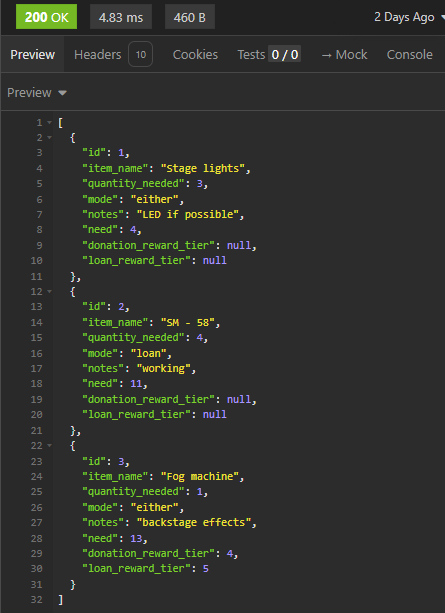

### Example: Create Item Needs (POST/item-needs)

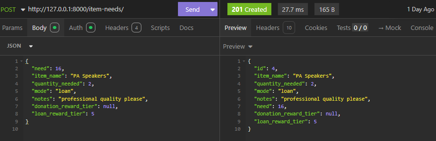

## Pledges

### Base Pledge

| URL              | Method | Purpose           | Request Body                                 | Success | Auth                                      |
| ---------------- | ------ | ----------------- | -------------------------------------------- | ------- | ----------------------------------------- |
| `/pledges/`      | GET    | List all pledges  | –                                            | 200     | Logged-in or Public (depending on config) |
| `/pledges/`      | POST   | Create a pledge   | `fundraiser`, `need`, `comment`, `anonymous` | 201     | Logged-in                                 |
| `/pledges/<id>/` | GET    | Retrieve a pledge | –                                            | 200     | Supporter or Fundraiser owner             |
| `/pledges/<id>/` | PUT    | Update pledge     | `comment`, `anonymous`, `status`             | 200     | Supporter only                            |
| `/pledges/<id>/` | DELETE | Delete pledge     | –                                            | 204     | Supporter (only if `status = pending`)    |

### Example: Get Pledge (GET/pledges)


### Example: Create Pledges (POST/pledges)

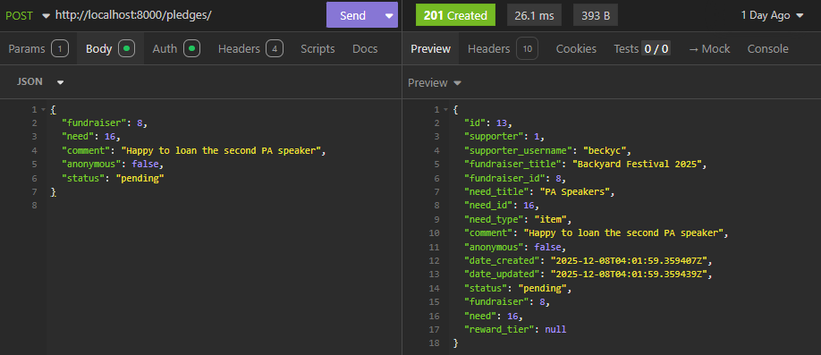

## Pledge Detail Models

### Money Pledge

| URL                    | Method | Purpose              | Request Body                  | Success | Auth                          |
| ---------------------- | ------ | -------------------- | ----------------------------- | ------- | ----------------------------- |
| `/money-pledges/`      | POST   | Create MoneyPledge   | `pledge`, `amount`, `comment` | 201     | Supporter only                |
| `/money-pledges/<id>/` | GET    | Retrieve MoneyPledge | –                             | 200     | Supporter or Fundraiser owner |
| `/money-pledges/<id>/` | PUT    | Update MoneyPledge   | `amount`, `comment`           | 200     | Supporter only                |
| `/money-pledges/<id>/` | DELETE | Delete MoneyPledge   | –                             | 204     | Supporter only                |

### Example: Get Money Pledge (GET/money-pledges)

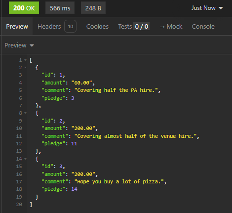

### Example: Create Money Pledge (POST/money-pledges)


### Time Pledge

| URL                   | Method | Purpose             | Request Body                                                  | Success | Auth                          |
| --------------------- | ------ | ------------------- | ------------------------------------------------------------- | ------- | ----------------------------- |
| `/time-pledges/`      | POST   | Create TimePledge   | `pledge`, `start_datetime`, `end_datetime`, `hours_committed` | 201     | Supporter only                |
| `/time-pledges/<id>/` | GET    | Retrieve TimePledge | –                                                             | 200     | Supporter or Fundraiser owner |
| `/time-pledges/<id>/` | PUT    | Update TimePledge   | Same as POST                                                  | 200     | Supporter only                |
| `/time-pledges/<id>/` | DELETE | Delete TimePledge   | –                                                             | 204     | Supporter only                |

### Example: Get Time Pledge (GET/time-pledges)


### Example: Create Time Pledges (POST/time-pledges)


### Item Pledge

| URL                   | Method | Purpose             | Request Body                 | Success | Auth                          |
| --------------------- | ------ | ------------------- | ---------------------------- | ------- | ----------------------------- |
| `/item-pledges/`      | POST   | Create ItemPledge   | `pledge`, `quantity`, `mode` | 201     | Supporter only                |
| `/item-pledges/<id>/` | GET    | Retrieve ItemPledge | –                            | 200     | Supporter or Fundraiser owner |
| `/item-pledges/<id>/` | PUT    | Update ItemPledge   | Same fields as POST          | 200     | Supporter only                |
| `/item-pledges/<id>/` | DELETE | Delete ItemPledge   | –                            | 204     | Supporter only                |

### Example: Get Item Pledge (GET/item-pledges)


### Example: Create Item Pledges (POST/item-pledges)


### Reward Tiers

Reward tiers can be optionally linked to MoneyNeed, TimeNeed or ItemNeed and allow supporters to receive bonuses when pledging.

| URL                   | Method | Purpose             | Request Body                        | Success | Auth             |
| --------------------- | ------ | ------------------- | ----------------------------------- | ------- | ---------------- |
| `/reward-tiers/`      | GET    | List reward tiers   | –                                   | 200     | None             |
| `/reward-tiers/`      | POST   | Create RewardTier   | `fundraiser`, `name`, `description` | 201     | Fundraiser owner |
| `/reward-tiers/<id>/` | GET    | Retrieve RewardTier | –                                   | 200     | None             |
| `/reward-tiers/<id>/` | PUT    | Update RewardTier   | Same as POST                        | 200     | Fundraiser owner |
| `/reward-tiers/<id>/` | DELETE | Delete RewardTier   | –                                   | 204     | Fundraiser owner |

### Example: Get Reward Tier (GET/reward-tiers/)

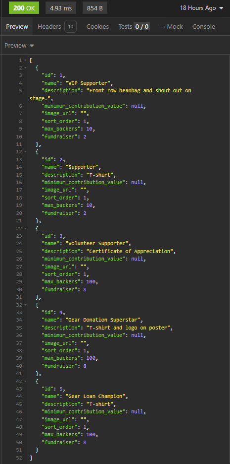

### Example: Create Reward Tier (POST/reward-tiers/)

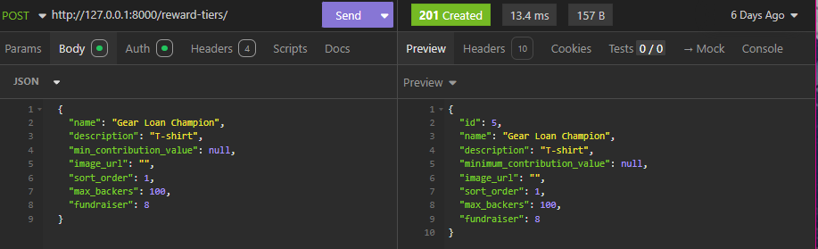

## Reporting Endpoints

### Fundraiser Summary

| URL                                  | Method | Purpose                                 | Request Body | Success | Auth |
| ------------------------------------ | ------ | --------------------------------------- | ------------ | ------- | ---- |
| `/reports/fundraisers/<id>/summary/` | GET    | Returns full dashboard for a fundraiser | –            | 200     | None |

### Need Progress

| URL                             | Method | Purpose                                     | Request Body | Success | Auth |
| ------------------------------- | ------ | ------------------------------------------- | ------------ | ------- | ---- |
| `/reports/needs/<id>/progress/` | GET    | Returns progress snapshot for a single need | –            | 200     | None |

### My Fundraisers

| URL                        | Method | Purpose                                   | Request Body | Success | Auth      |
| -------------------------- | ------ | ----------------------------------------- | ------------ | ------- | --------- |
| `/reports/my-fundraisers/` | GET    | Lists summaries for all fundraisers I own | –            | 200     | Logged-in |

### DB Schema


